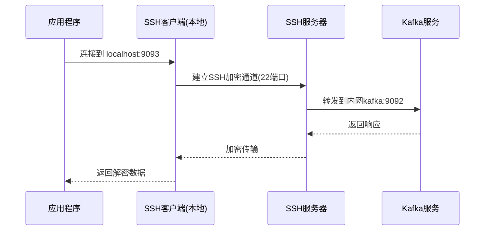

kafka GUI客户端 v0.41 发布

<!-- truncate -->

# 新版本功能介绍
## ZH
**新增功能：支持SSH隧道** 

开源软件，用爱发电，喜欢请多多宣传！
网不好去Q群下载：964440643
bug反馈：https://github.com/Bronya0/Kafka-King/issues

# 核心

SSH 隧道（SSH Tunneling）是一种通过加密的 SSH 连接在客户端和远程服务器之间传输任意网络数据的技术。它允许客户端通过一个中间服务器（SSH 服务器）访问不可直接访问的远程资源（如 Kafka 集群）。在 Kafka 连接场景中，SSH 隧道通常用于绕过网络限制（如防火墙）或访问私有网络中的 Kafka 集群。

SSH 隧道通过 本地端口转发（Local Port Forwarding） 实现 Kafka 连接：

客户端通过 SSH 连接到一个可访问 Kafka 集群的中间服务器（Jump Host 或 Bastion Host）。
SSH 隧道在本地机器上创建一个监听端口（Local Port），将流量通过 SSH 服务器转发到 Kafka Broker 的地址和端口。
客户端应用程序（如 Kafka 生产者或消费者）连接到本地监听端口，流量通过 SSH 隧道透明地转发到 Kafka Broker。
Kafka 客户端仍然需要正确配置 bootstrap.servers，但地址设置为 localhost:本地端口，而不是直接的 Broker 地址。

具体过程如下：

客户端与SSH服务器建立安全连接

SSH客户端在本地打开一个端口（如9093）

所有发送到本地端口的流量通过SSH加密通道转发

SSH服务器将流量解密后转发到目标Kafka服务端口（如9092）

Kafka的响应数据沿原路返回

这样，本地应用程序只需要连接本地端口，就像直接连接Kafka一样，而实际通信是通过SSH加密的。



# 参考代码

```go
package main

import (
  "fmt"
  "golang.org/x/crypto/ssh"
  "log"
  "net"
  "os"
)

func createSSHTunnel(sshUser, sshPassword, sshHost string, sshPort int, localPort int, remoteHost string, remotePort int) error {
  // SSH客户端配置
  config := &ssh.ClientConfig{
    User: sshUser,
    Auth: []ssh.AuthMethod{
      ssh.Password(sshPassword),
    },
    HostKeyCallback: ssh.InsecureIgnoreHostKey(),
  }

  // 连接SSH服务器
  sshConn, err := ssh.Dial("tcp", fmt.Sprintf("%s:%d", sshHost, sshPort), config)
  if err != nil {
    return fmt.Errorf("failed to dial SSH: %v", err)
  }

  // 在本地监听端口
  localListener, err := net.Listen("tcp", fmt.Sprintf("127.0.0.1:%d", localPort))
  if err != nil {
    return fmt.Errorf("failed to listen on local port: %v", err)
  }

  // 处理连接
  go func() {
    for {
      localConn, err := localListener.Accept()
      if err != nil {
        log.Printf("failed to accept local connection: %v", err)
        continue
      }

      // 通过SSH隧道建立到远程Kafka的连接
      remoteConn, err := sshConn.Dial("tcp", fmt.Sprintf("%s:%d", remoteHost, remotePort))
      if err != nil {
        log.Printf("failed to dial remote Kafka: %v", err)
        localConn.Close()
        continue
      }

      // 转发数据
      go forward(localConn, remoteConn)
      go forward(remoteConn, localConn)
    }
  }()

  log.Printf("SSH tunnel established: localhost:%d -> %s:%d", localPort, remoteHost, remotePort)
  return nil
}

func forward(dst net.Conn, src net.Conn) {
  defer dst.Close()
  defer src.Close()
  io.Copy(dst, src)
}
```